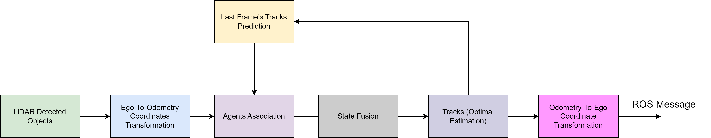

# Object Fusion C++ SDK For Autonomous Driving

*Author: Gaowei Xu (gaowexu1991@gmail.com)*


### 1. Introduction

In this repository, a typical object fusion SDK is implemented with C++/Bazel toolchain. It exploites linear kalman process for object prediction and fusion. For fusion part, L2 eucidean distance and intersection over union (IoU) are both applied. This SDK could be applied or generalized for multi-sensor object fusion in highway scenarios (such as NOP, LCC, LKA, ACC). In this reposity, the following features are supported:

[x] Kalman process C++ implementation.

[x] Objects association with Munkres algorithm.

[x] Bazel build and unit test for each module of object fusion SDK.


### 2. Kalman & Object Fusion



In this repository, we take LiDAR object detection (single channel sensor input) as example, to formulate the Kalman process. Firstly, the LiDAR detected 3D objects are convert to odometry cooridnate system from ego vehicle rear axis coordinate system. Then Kalman prediction, agents association, state fusion (including create new tracks) are cascaded. Finally, these fused objects (optimal estimation) are transformed back to ego vehicle rear axis coordinate system and published via ROS message.

### 3. Bazel Build & Unit Test

#### 3.1 Virtual Third-Party Packages Server Setup


#### 3.2 Build & Test of Third-Party Packages


#### 3.3 Build & Unit Test of Object Fusion SDK

```
bazel test --test_output=all //modules/test:object_fusion_unit_test
```

```
INFO: Analyzed target //modules/test:object_fusion_unit_test (0 packages loaded, 0 targets configured).
INFO: Found 1 test target...
Target //modules/test:object_fusion_unit_test up-to-date:
  bazel-bin/modules/test/object_fusion_unit_test
INFO: Elapsed time: 4.626s, Critical Path: 4.47s
INFO: 3 processes: 1 internal, 2 linux-sandbox.
INFO: Build completed successfully, 3 total actions
PASSED: //modules/test:object_fusion_unit_test (see /home/xuzhu/.cache/bazel/_bazel_xuzhu/2ed4ae248c27c3f1258ed98a2867df24/execroot/object_fusion/bazel-out/k8-fastbuild/testlogs/modules/test/object_fusion_unit_test/test.log)
INFO: From Testing //modules/test:object_fusion_unit_test
==================== Test output for //modules/test:object_fusion_unit_test:
Running main() from gmock_main.cc
[==========] Running 1 test from 1 test suite.
[----------] Global test environment set-up.
[----------] 1 test from perception
[ RUN      ] perception.BEVObjectFusionUnitTest
[       OK ] perception.BEVObjectFusionUnitTest (334 ms)
[----------] 1 test from perception (334 ms total)

[----------] Global test environment tear-down
[==========] 1 test from 1 test suite ran. (334 ms total)
[  PASSED  ] 1 test.
================================================================================
//modules/test:object_fusion_unit_test                          (cached) PASSED in 0.4s

INFO: Build completed successfully, 3 total actions

```

### 4. Liscene


### 5. Reference


